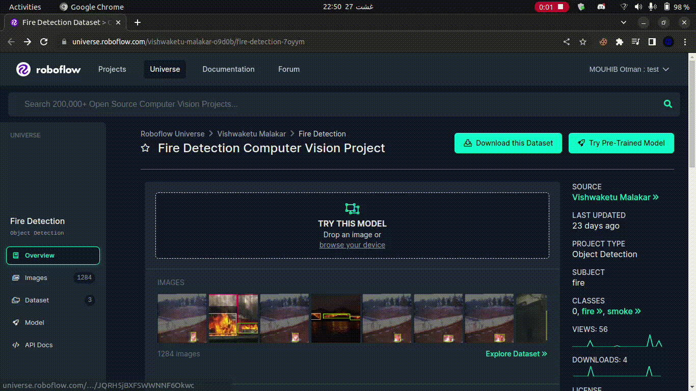
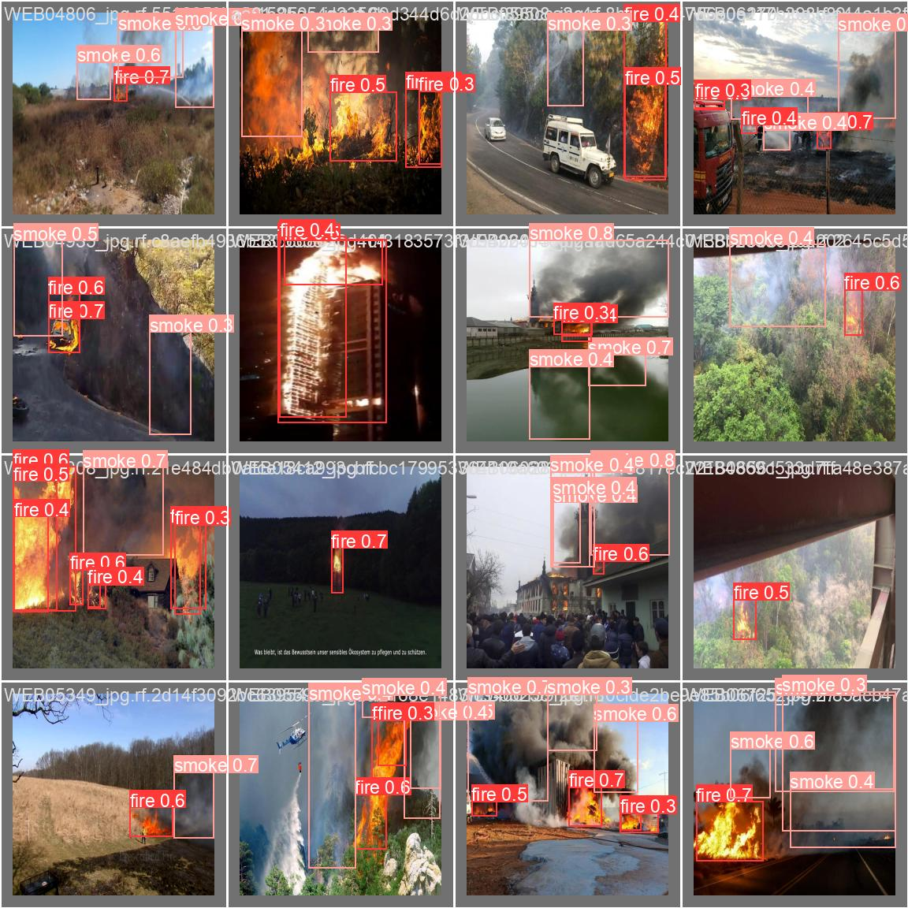
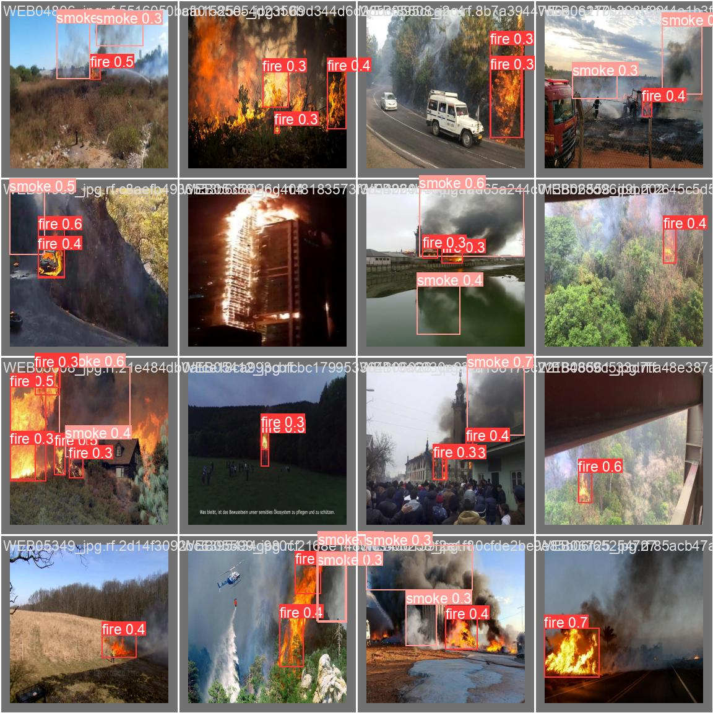

# <h1 style="font-size:40px; text-align:center;"> AI-ATAR
<h6 style="font-size:40px; text-align:center;"> Real-Time Forest Fire Detection

## <h2 style="font-size:30px; ">Introduction
<p style="font-size:20px; ">The Real-Time Forest Fire Detection project employs cutting-edge deep learning techniques to detect and respond to forest fires promptly. Leveraging YOLO (You Only Look Once) models and efficient object detection algorithms, this project aims to contribute to early fire detection, reducing the risk of catastrophic damage to our natural landscapes.</p>

## <h2 style="font-size:30px; ">Project in Action
   
<br>This GIF demonstrates how the fire detection system detects fire in a real-time video stream.

## <h2 style="font-size:30px; ">Features
- **Video-Based Detection**: Detect fires in real-time from video streams, enabling swift intervention.
- **Efficient Algorithms**: Utilize YOLO models for accurate and rapid fire detection.
- **Customization**: Easily adapt the models and configurations to suit specific detection requirements.
- **Live Streaming**: Enable live fire detection from webcams or video sources for immediate monitoring.
# YOLOv8 Model Training using the `python -m App` Command

Welcome to the guide on how to train a YOLOv8 model using the `python -m App` command. YOLOv8 is a popular object detection algorithm known for its speed and accuracy. This guide will walk you through the steps required to train your own YOLOv8 model using the provided Python script.

## Prerequisites

Before you begin, make sure you have the following prerequisites installed:

- Python (>= 3.6)
- PyTorch (>= 1.7)
- CUDA (for GPU training, recommended)
- OpenCV
- Requirements specified in `requirements.txt` (provided with the repository)


## <h2 style="font-size:30px; "> Table of Contents

- [Installation](#Installation)
- [Configuration](#configuration)
- [Usage](#usage)
  - [Usage1](#usage1)
    - [App.py](#usage1)
  - [Usage2](#usage1)
    - [Download dataset using roboflow](#usage1)
    - [Train a model](#usage1)
    - [Resume incomplete Train](#usage1)
    - [Validate Trained model](#usage1)
    - [Test model on local video Sample](#usage1)
    - [Test model on live stream](#usage1)
- [Datasets](#datasets)
- [Models](#models)
- [Example](#examples)
  - [Dataset](#Dataset)
  <br>will in clude the link of the dataset used and how to extract the elements needed for the download 
    <br>https://universe.roboflow.com/vishwaketu-malakar-o9d0b/fire-detection-7oyym/dataset/6#
  - [Train](#Train)
  <br> the training method used and how access the training folder
  we trained the models n s m for each for 3 different epochs 50 100 300 and you will find your training folder on this path
  - [Resume Train](#resume train)
  <br> how to resumed a crashed training<br>
  incase you trainning stopped or crashed after finishing the first epoch the training can resume this way 
  - [Validate](#Validate)
  <br> how to validate a trained model and access the validation folder
  <br> we can validate our trained models this way and you ll find your validation folder under this path 
  - [Performance metrix evaluation](#performance metrics evaluation)
  <br> compare some performance metrics of the pretrained model
  - [Test on local video sample](#Test on local video sample)
  <br> test the trained models on local video samples and access the results 
  <br> this is how you test on local samples :
  <br> here you put the video here you ll find the results and that s how you do it
  
  - [Test Real Time](#test real time)
  <br> test the trained models on live stream and access the saved results
  <br> this is how you test on local samples :
  <br> here you put the video here you ll find the results and that s how you do it
  
- [Contributing](#contributing)
- [License](#license)
- [Contact](#contact)
- [Acknowledgements](#acknowledgements)

## <h2 style="font-size:30px; "> Installation
## Important Note: GPU Compatibility and TensorFlow-GPU Installation

>If you intend to use this project with GPU acceleration for deep learning tasks, it's crucial to ensure that you have the correct NVIDIA and CUDA drivers installed that are compatible with your GPU. Additionally, make sure you have a compatible version of TensorFlow-GPU.

>To check the compatibility of your GPU with the required drivers and TensorFlow-GPU version, as well as for detailed installation instructions, please refer to the official TensorFlow documentation: [TensorFlow GPU Installation Guide](https://www.tensorflow.org/install/source)

>Having the appropriate GPU drivers and TensorFlow-GPU version will ensure optimal performance and compatibility when running deep learning tasks on your system.

>Please note that GPU support requires proper setup and compatibility, and it's recommended to follow the official installation guide provided by TensorFlow for a smooth experience.

1. Clone this repository:
   ```sh
   user@ubuntu:~$  git clone https://github.com/AI-ForestFireDetection/AI-Yolo.git
   ```
2. Access the Repo:
   ```sh
   user@ubuntu:~$ cd AI-Yolo/
   ```
3. Create your Python env :
   ```sh
   user@ubuntu:~/AI-Yolo$ python3 -m venv venv
   ```
4. Activate your python env:
   ```sh
   (venv) user@ubuntu:~/AI-Yolo$ source  ./venv/bin/activate
   ```
5. Install the required dependencies:
   ```sh
   (venv) user@ubuntu:~/AI-Yolo$ pip install ultralytics opencv-python
   ```
## <h2 style="font-size:30px; ">Configuration
>Configuring and adapting the fire and smoke detection to your specific requirements is straightforward. Simply follow these steps:

1. **Setup Environment:**
   >Ensure you have all necessary dependencies installed, including Python, required libraries, and any pretrained models you plan to use. Refer to the project's documentation for installation instructions.

2. **Prepare Data:**
   >If you're using custom data, make sure your images are properly formatted and organized. For instance, put your test images in a designated directory.

3. **Run the Script:**
   >Execute the provided Python script, and it will prompt you for the necessary input:
   ```sh
   python -m App
   ```
   
   >The script will guide you through the process, requesting paths to images, model checkpoints, and optional parameters like threshold values or epochs based on the action you want to perform based on your choice from the displayed menu.

4. **Adapt Parameters:**

   >Modify the parameters within the script to tailor the detection to your specific needs. The prompts will guide you to input values such as threshold for confidence scores, number of epochs, and more.

   >Remember that this project is open-source and under the MIT license. Feel free to experiment by hard coding values directly in the script if you're curious about how changes impact detection performance. The entire process is designed to be intuitive, and you have the flexibility to explore and modify parameters for experimentation.

5. **Review Results:**

   >The script will generate detection results based on your provided inputs. It will display the detected classes, confidence scores and many more useful information.

6. **Fine-Tune as Needed:**
   >Depending on the results and your specific use case, you can adjust the parameters further and re-run the script to refine the detection.
   >The entire process is designed to be intuitive and user-friendly. You don't need to edit complex configuration files. Instead, you'll be guided step-by-step through the script's prompts to insert the correct paths, file names, and other values. This flexibility allows you to adapt the detection to various scenarios and achieve accurate results effortlessly.

## <h2 style="font-size:30px; "> Usage
1. ### Using App.py file :
    Run the `App.py` file to access all the utilities .
    ```sh
    (venv) user@ubuntu:~/AI-Yolo$ python -m App
    ```
    OUTPUT
    ```sh
    (venv) user@ubuntu:~/AI-Yolo$ python -m App
    
    
    Welcome To ATAR ! :)
    2023-08-25 23:30:09,558 - INFO


        -----------------------
        Welcome to My CLI Menu
        -----------------------

                1. Download RoboFlow straining dataset
                2. Train
                3. Resume existing Train
                4. Valid
                5. Live Test
                6. test on an existing file
                7. Quit

        ----------------------------------------------------------
        To exit the CLI menu, choose option '7' or press 'Ctrl+C'.
        ------------------------------------------------------------

    Execution time: 0.00 seconds
    2023-08-25 23:30:09,559 - INFO


          ======> Enter your choice : 

    ```
2. ### Using Each utility on it s own :

    ### Video Detection 
    Run the `videoDetect()` function to detect fires in a video file.

    ```sh
    (venv) user@ubuntu:~/AI-Yolo$ python -c 'from src.Utilities.vDetect import video_detect; video_detect()'
    ```
    OUTPUT
    ```sh
    (venv) user@ubuntu:~/AI-Yolo$ python -c 'from src.Utilities.vDetect import video_detect; video_detect()'


                1. video1.mp4

          ======> Enter the number of your choice: 

    ```
    ### Live Stream Detection
    
    Run the `Stream()` function to start a live stream for fire detection.
    
    ```sh
    python -c 'from src.Utilities.sDetect import stream; stream()'
    ```
    OUTPUT
    ```sh
    (venv) user@ubuntu:~/AI-Yolo$ python -c 'from src.Utilities.sDetect import stream; stream()'

    STREAM START
    2023-08-25 23:53:12,919 - INFO

          ======> source :
    ```
    ### Model Training
    
    Run the `train()` function to train your own YOLO model.
    
    ```sh
    python -c 'from src.Utilities.modelTrain import m_train; m_train()'
    ```
    OUTPUT
    ```sh

    (venv) user@ubuntu:~/AI-Yolo$  python -c 'from src.Utilities.modelTrain import m_train; m_train()'


                1. yolov8n.pt
                2. yolov8s.pt
                3. yolov8m.pt
                4. yolov8l.pt
                5. yolov8x.pt

          ======> Enter the number of your choice: 
    ```

    ### Validation
    Run the `valid()` function to validate your YOLO model.

    ```sh
    python -c 'from src.Utilities.modelValid import m_valid; m_valid()'
    ```
    OUTPUT
    ```sh
    (venv) user@ubuntu:~/AI-Yolo$ python -c 'from src.Utilities.modelValid import m_valid; m_valid()'


                1. train-e100-i256-w8-v8s
                2. train-e300-i240-w8-v8s
                3. train-e100-i256-w8-v8n
                4. train-e300-i256-w8-v8n
                5. train-e50-i256-w8-v8n
                6. train-e50-i256-w8-v8s

          ======> Enter the number of your choice: 
    ```
## <h2 style="font-size:30px; ">Example
## [Dataset](#Dataset)
Roboflow, your premier data annotation and dataset resource, 
simplifies the annotation process for your images and videos 
while also offering a repository of high-quality, pre-existing 
datasets for your convenience. <br>Seamlessly enhance your machine 
learning projects with accurately labeled data or 
access to curated datasets.

## Why Roboflow?

- **Efficient Annotation:** Annotate images and videos quickly with intuitive tools.
- **Diverse Annotations:** Support for object detection, segmentation, and more.
- **High-Quality Datasets:** Explore and download datasets for various applications.
- **Community:** Join a collaborative community of ML enthusiasts.

## Getting Started

1. **Sign Up:** Create an account at [Roboflow](https://roboflow.com/signup).
2. **Annotate:** Label your data using Roboflow tools.
3. **Download:** Find and use datasets for your projects.
4. **Connect:** Engage with the community and share insights.
## Recommended Fire Detection Dataset
Check out the curated "Fire Detection" dataset by vishwaketu-malakar-o9d0b:

> We have used this dataset for the testing of this tool 
> we will be evaluating the performance later on together on some models trained under this dataset
- [Fire Detection Dataset](https://universe.roboflow.com/vishwaketu-malakar-o9d0b/fire-detection-7oyym/dataset/6#)
> follow this preview in order to download your dataset : 
>- either dowload as zip and extract and put on the directory "src/datasets/" and move directly to the training process
>- or get the strings provided in the download code and insert them respectively like this 


 EXAMPLE OUTPUT


  
## [Train](#Train)

   Run the training script using the following command and insert you Training configuration :
   ```bash
   (venv) user@ubuntu:~/AI-Yolo$ python -m App 
   ```

## Conclusion
EXAMPLE OUTPUT


Congratulations! You've successfully trained a YOLOv8 model using the `python -m App` command. Experiment with different configurations, datasets, and hyperparameters to achieve the best results for your specific object detection task. If you encounter any issues or need further assistance, refer to the repository's documentation or seek help from the community.
<br> For our example we will be using the models yolov8n.pt , yolov8s.pt, yolov8m.pt
and we ll be tranning each model 3 times (50 epochs, 100 epochs, 300 epochs)
with other fixed configuration (workers 8, 256 imgsz)
and dont forget to mention if you re using 'CPU' put ur GPU device id in ddevice value <br>
<br>Happy training! 🚀

## [Resume Train](#resume train)
If your trainning ever crashed you can use this functionality to resume the training  


>Congratulations! You've successfully resumed a crashed trainning 
the training will contuinue on the same confuration setted first
<br>Training rescued ! 🚀

## [Validate](#Validate)
how to validate a trained model and access the validation folder


## [Performance metrix evaluation](#performance metrics evaluation)
### Yolov8n
<br>Train/train-e300-i256-w8-v8n/val_batch1_pred.jpg

### Yolov8s
<br>Train/train-e300-i256-w8-v8s/val_batch1_pred.jpg

### Yolov8m
<br>Train/train-e300-i256-w8-v8s/val_batch1_pred.jpg


## [Test on local video sample](#Test on local video sample)


## [Test Real Time](#test real time)
test the trained models on live stream and access the saved results 


## Contributing

>Contributions are welcome! Fork the repository, create a new branch, and submit a pull request.

## License
This project is licensed under the [MIT License](LICENSE).

## Contact
For questions or feedback, feel free to reach out to [MOUHIB Otman](mailto:mouhib.otm@gmail.com) or [BACCARI Rihab](mailto:)
## Acknowledgements
- Ultralytics for YOLO wrapper
- Roboflow for dataset

## User Reviews
> "I've been using this forest fire detection system for a while now, and it has significantly improved our response time to potential fire outbreaks. The accuracy and real-time detection capabilities are impressive." (Review Example)
> — John Doe, Forest Ranger (Reviewer name , username Example)

 